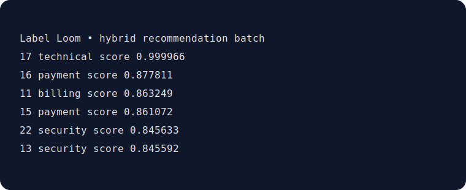

# Label Loom

[](https://github.com/KanadeK/label-loom/actions/workflows/ci.yml)
[](LICENSE)
[](https://github.com/KanadeK/label-loom/releases)

**Label Loom is an offline CLI that recommends the next text samples to annotate when budget is scarce.** It combines model uncertainty, pool diversity, and predicted-class balancing, then exports a reviewable batch and an annotation-round cost log. Current status: **v0.1.0**.



- Stay local: the baseline is TF-IDF plus scikit-learn logistic regression; no network calls are made.
- Choose deliberately: uncertainty, diversity, or a weighted hybrid, with deterministic results.
- Stay auditable: CSV/JSON exports and an append-only round ledger record batch size, strategy, timestamp, and cost.

## Install and run

```bash
python -m pip install -e '.[dev]'
label-loom recommend examples/demo_pool.csv --output recommendations.csv --ledger annotation-rounds.json --strategy hybrid --budget 6 --batch-size 6
```

The command reads the `label` values already available, selects only rows with an empty `label`, and produces an output like:

```csv
id,text,predicted_label,uncertainty,diversity,score
19,Please lock my account because my device was stolen,security,0.813...,1.0,0.878...
```

## How it works

1. Import a UTF-8 CSV with `text`, optional `id`, and `label` columns. A missing or blank label denotes the unlabeled pool.
2. Label Loom trains a deterministic TF-IDF/logistic-regression baseline from the labeled rows. At least two labeled classes are required.
3. Select a batch with `uncertainty`, `diversity`, or `hybrid`; predicted-class quotas prevent a single class from consuming the batch.
4. Send the exported CSV to annotators, add their labels to the source CSV, and run another round.

The bundled [demo pool](examples/demo_pool.csv) is synthetic support text with five categories, deliberately varied phrasing, label noise context, and a rare security class. It contains no personal or production data.

## CLI

```text
label-loom recommend INPUT [--output FILE] [--ledger FILE]
  --strategy uncertainty|diversity|hybrid
  --budget 10 --batch-size 10 --unit-cost 0.12
  --no-class-balance --text-column text --label-column label
```

`budget` is the maximum annotation spend for this run and `batch-size` caps one exported batch. The effective selection is the smaller of the two and the available pool. Outputs ending in `.csv` or `.json` are supported. Invalid columns, missing files, a one-class training set, and unsupported export types fail loudly.

## Development and release checks

```bash
python scripts/verify.py
python scripts/demo.py
python scripts/package_release.py
python scripts/release_check.py
```

`make verify`, `make demo`, `make package`, and `make release-check` provide equivalent entry points on systems with Make. The scripts work on Windows with `python` as well. Tests cover domain rules, file integration, CLI export, error paths, and deterministic selections; the quality gate enforces 80% source coverage.

## Architecture and boundaries

The domain engine is independent of the CLI and filesystem adapters. See [Architecture](docs/ARCHITECTURE.md). Label Loom is for small text-classification annotation workflows, not an annotation UI, a trained production classifier, or a substitute for expert review. Read [Privacy and security](docs/PRIVACY_AND_SECURITY.md) before importing sensitive text.

## Why this project

A public-repository sample scan found no active, same-name project with this focused workflow. Established libraries such as modAL, ALiPy, BaaL, and Google Active Learning are broader frameworks. Label Loom intentionally concentrates on local CSV intake, inspectable selection exports, per-round cost records, and a dependency-light sklearn baseline. Details: [competitor scan](docs/COMPETITOR_SCAN.md).

## Contributing and roadmap

Contributions are welcome; start with [CONTRIBUTING.md](CONTRIBUTING.md) and the [Code of Conduct](CODE_OF_CONDUCT.md). Planned next work is multi-label support, reviewer feedback import, and optional local web visualization. Security reporting is described in [SECURITY.md](SECURITY.md).

## License

MIT, see [LICENSE](LICENSE).
